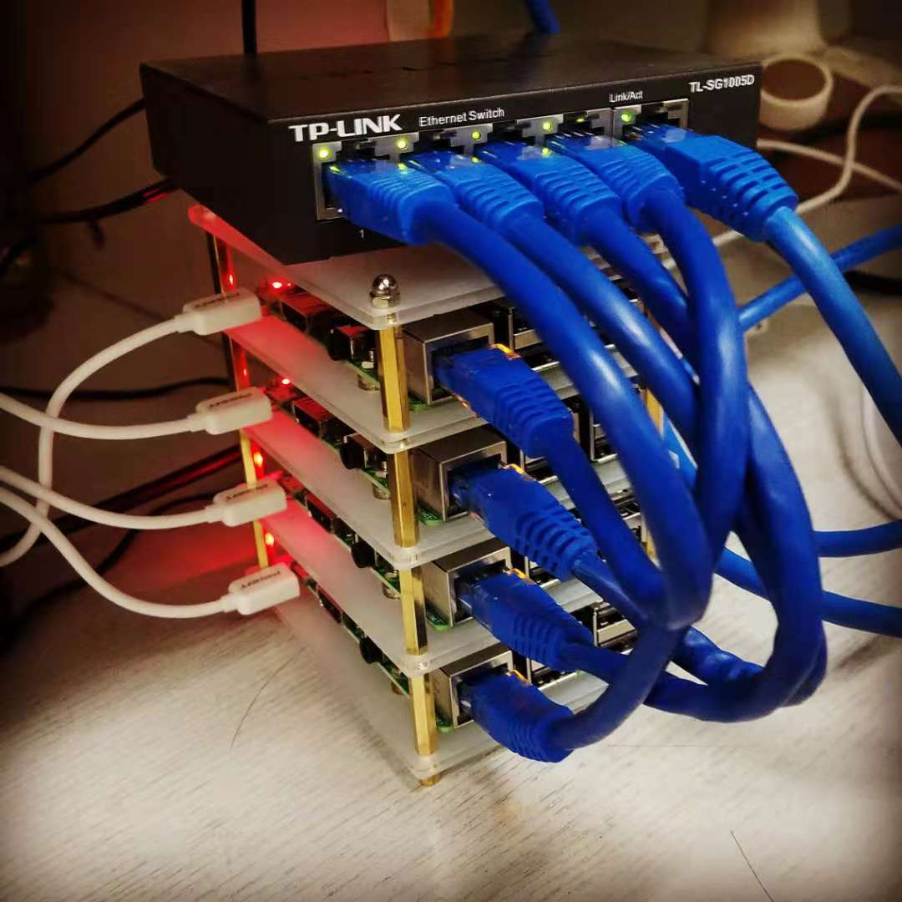

# RaspPi-Cluster

The following tutorial I will use a four node Raspberry Pi Cluster for an example.

> (And I'll use my preferred selection between many similar options.)
>
> i.e. the memory allocation settings is fit for Raspberry Pi 3 with 1G RAM

After setting up the environment, I'll implement some popular distributed computing ecosystem on it.
And try to write a quick start script for them. And maybe some example demo.

## Usage

[**Usage in Detail !!**](Documentation/FabfileHelp.md) (Manual)

### Quick Start

First check user setting in [fabfile.py](fabfile.py) (Important!) ([Connection Setting Example](Documentation/ConnectionSetting.md))

```sh
# Install local dependencies
python3 -m pip install -r requirements.txt
```

#### Quick Setup

```sh
fab update-and-upgrade # Make apt-get up to date
fab env-setup # Quick install basic utility function
fab set-hostname # Set hostname for each node (will need to reboot)
fab ssh-config # Generate ssh-key and setup to all nodes
fab change-passwd # Change password for more security (Remember also change in fabfile.py later if you have changed pi's passowrd)
```

**Regular used function** (make sure you've generated ssh-key or move your ssh-key to `./connection/id_rsa`)

```sh
fab ssh-connect NODE_NUM # Connect to any node by it's index without password (use -h flag to be hadoop user)
fab uploadfile file_or_dir -s -p # Upload file or folder to remote (specific node use -n=NODE_NUM flag)
```

#### Hadoop

If you changed default hostname in `fabfile.py` or `configure.yaml`.
Make sure you also changed the Hadoop configuraiton file in ./Files.

```sh
fab install-hadoop # An one button setup for hadoop environment on all nodes!!!

fab update-hadoop-conf # Every time you update configure file in local you can update it to all nodes at once
```

(the key of Hadoop user is store in `./connection/hadoopSSH`)

Utility function

```sh
fab start-hadoop
fab restart-hadoop
fab stop-hadoop

fab status-hadoop # Monitor Hadoop behavior

fab example-hadoop # If everything is done. You can play around with some hadoop official example
```

#### Spark

If you changed default hostname in `fabfile.py` or `configure.yaml`.
Make sure you also changed the Spark configuraiton file in ./Files.

```sh
fab install-spark
```

There are lots of utility function like I did for Hadoop. Check it out by `fab --list`

## Example

Subject|Ecosystem|Purpose
-------|---------|-------
[MapReduce Practice](Example/MapReduce/)|Hadoop|MapReduce practice with Hadoop Streaming
[Spark Practice](Example/SparkExample/)|Spark|

## Steps

A step by step record of how I build this system.

* [Preparation](Tutorial/Preparation.md)
    * Hardware purchase
    * Software package and dependencies (PC/Laptop)
        * Python > 3.6
        * Fabric 2.X

1. [Setup Raspberry Pis](Tutorial/SetupRaspPi.md)
2. Assemble hardwares

    

3. [Setup fabric (brief notes)](Tutorial/SetupFabric.md) - execute shell commands remotely over SSH to all hosts at once!
    * I've built some utility function first and then move on setup Hadoop
    * when any general purpose manipulation needed I'll add it.
4. [Setup Hadoop](Tutorial/SetupHadoop.md)
5. [Setup Spark](Tutorial/SetupSpark.md)
6. [Setup Kubernetes](Tutorial/SetupKubernetes.md)
7. [Setup Distributed Tensorflow](Tutorial/SetupDestributedTensorflow.md)
    * on Hadoop
    * on Kubernetes

## Notes about distributed computing

Algorithm

* [MapReduce](Notes/Distributed_Computing/MapReduce.md)

## Notes about specific ecosystem

[Hadoop](Notes/Hadoop/Hadoop.md)

* [HDFS](Notes/Hadoop/HDFS.md)
* [YARN](Notes/Hadoop/YARN.md)

[Spark](Notes/Spark/Spark.md)

Kubernetes

Distributed Tensorflow

## TODO

* [X] Expand to support any other Debian/Unix system
* [X] Better switch between multiple configuration files for multi-server
    * Use *.yaml
* More friendly Document
* Hadoop utility function introduction
* Dynamic Configure based on different hardware and maybe GUI and save multiple settings
    * Set up hardware detail e.g. RAM size
    * Read and write *.xml
* list some alterative note
    * pdsh == fab CMD
    * ssh-copy-id == ssh-config
